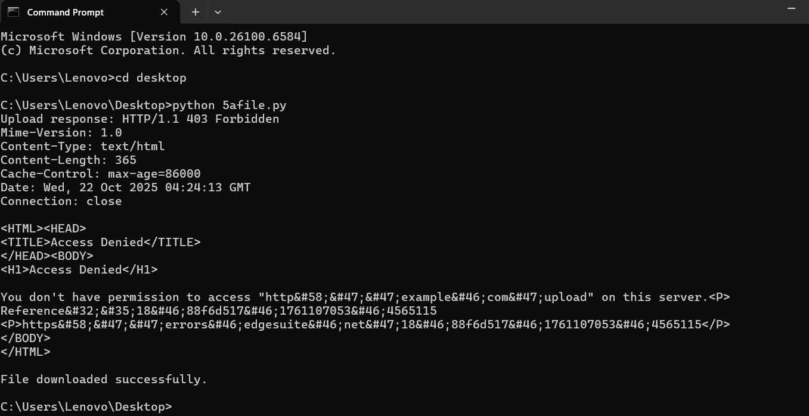

# 5a_Create_Socket_for_HTTP_for_webpage_upload_and_download
## AIM :
To write a PYTHON program for socket for HTTP for web page upload and download
## Algorithm

1.Start the program.
<BR>
2.Get the frame size from the user
<BR>
3.To create the frame based on the user request.
<BR>
4.To send frames to server from the client side.
<BR>
5.If your frames reach the server it will send ACK signal to client otherwise it will send NACK signal to client.
<BR>
6.Stop the program
<BR>

## Program :

```
import socket

def send_request(host, port, request_bytes):
    """Send raw bytes to server and return response as bytes"""
    with socket.socket(socket.AF_INET, socket.SOCK_STREAM) as s:
        s.connect((host, port))
        s.sendall(request_bytes)
        response = s.recv(4096)
    return response

def upload_file(host, port, filename):
    with open(filename, 'rb') as file:
        file_data = file.read()
        content_length = len(file_data)

        # Build proper POST request (binary safe)
        request_header = (
            f"POST / HTTP/1.1\r\n"
            f"Host: {host}\r\n"
            f"Content-Length: {content_length}\r\n"
            f"Content-Type: text/plain\r\n"
            f"\r\n"
        ).encode()

        request = request_header + file_data
        response = send_request(host, port, request)
    return response.decode(errors="ignore")

def download_file(host, port, filename):
    request = (
        f"GET /{filename} HTTP/1.1\r\n"
        f"Host: {host}\r\n"
        f"\r\n"
    ).encode()

    response = send_request(host, port, request)
    parts = response.split(b"\r\n\r\n", 1)
    if len(parts) == 2:
        headers, body = parts
        with open(f"downloaded_{filename}", 'wb') as f:
            f.write(body)
        print(f"✅ File downloaded as downloaded_{filename}")
    else:
        print("❌ Failed to parse server response")

if __name__ == "__main__":
    host = '127.0.0.1'  # Your local server
    port = 8000

    print("📤 Uploading file to server...")
    upload_response = upload_file(host, port, 'example.txt')
    print("Server response:\n", upload_response)

    print("\n📥 Downloading file from server...")
    download_file(host, port, 'example.txt')

```

## OUTPUT:

## Result
Thus the socket for HTTP for web page upload and download created and Executed
